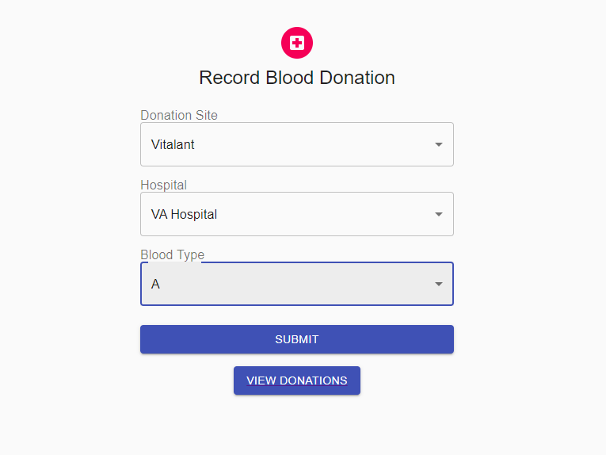
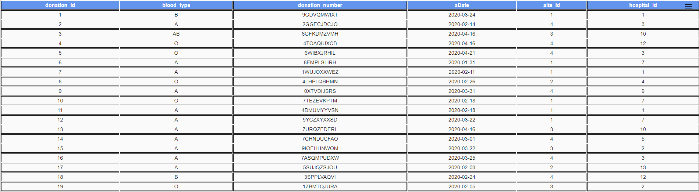
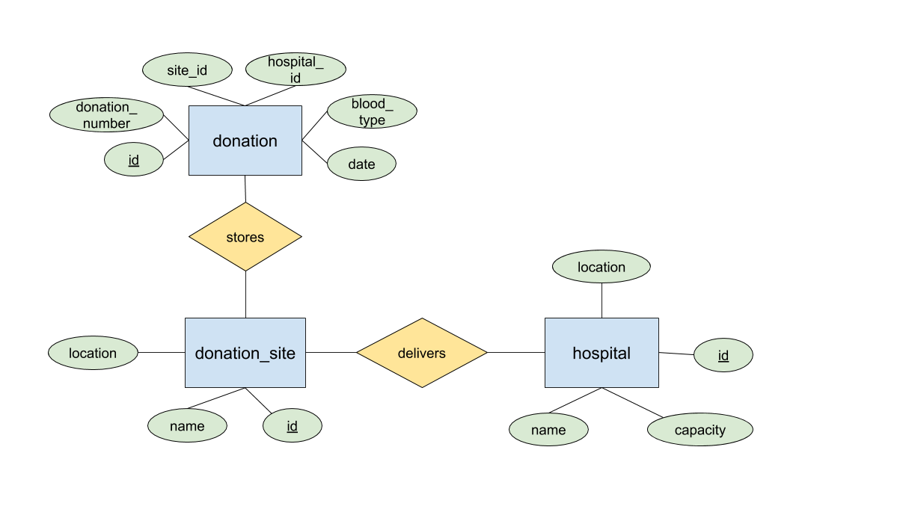

# San Jose State University
## Enterprise Software-CMPE172/Spring2020
### Team 13
### Angel Nguyen, Francisco Romero, Julio Mercado Soto

## Project Introduction
This application is a three tier web application that simulates the blood donation process. Users are able to virtually “donate” blood at particular donation sites. The user can then track their blood donation and learn details about its journey. Users will be able to view analytics such as the capacity of the hospitals, which hospitals receive the most of a certain blood type, and which donation sites receive the most donations. The project showcases various components that were introduced in CMPE 172 and sheds some light on the process that goes into donating blood. To learn more about donating blood, go [here](https://www.redcross.org/give-blood.html).

## Sample Demo Screeshots
This is the add donation page, which is where users can input a new donation.  They first choose a donation site, which narrows down the hospital options to those that are near the donation site.  Then the blood type is chosen before submission into the system.

From the add donation page, when the "view donations" button is pressed, the list of current donations in the system will be displayed.

## Setup Environment

## Build Locally
The frontend is a React application and the backend is a Java Spring Boot application run using Maven. 

Starting the client:  
`cd` to frontend folder  
`npm install`  
`npm start`  
Runs the app in the development mode.
Open http://localhost:3000 to view it in the browser.

Start the server:
 `mvn clean install` `mvn spring-boot:run` 

## Schema

## Database Queries

## Mid tier APIs

## UI Data Transport
JSON is used as the data transport format between the server and client. 
