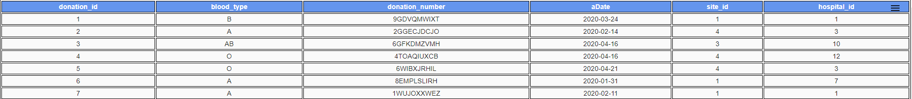
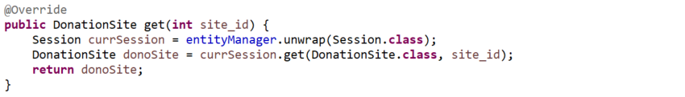
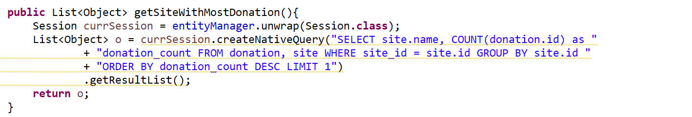

# San Jose State University
## Enterprise Software-CMPE172/Spring2020
### Team 13
### Angel Nguyen, Francisco Romero, Julio Mercado Soto

## Project Introduction
This application is a three tier web application that simulates the blood donation process. Users are able to virtually “donate” blood at particular donation sites. The user can then track their blood donation and learn details about its journey. Users will be able to view analytics such as the capacity of the hospitals, which hospitals receive the most of a certain blood type, and which donation sites receive the most donations. The project showcases various components that were introduced in CMPE 172 and sheds some light on the process that goes into donating blood. To learn more about donating blood, go [here](https://www.redcross.org/give-blood.html).

## Sample Demo Screenshots
This is the add donation page, which is where users can input a new donation.  They first choose a donation site, which narrows down the hospital options to those that are near the donation site.  Then the blood type is chosen before submission into the system.

From the add donation page, when the "view donations" button is pressed, the list of current donations in the system will be displayed.

There is also a page that displays the list of hospitals and donation sites, along with the overall analytics for the site with the greatest number of donations and the hospital with the greatest amounts of a particular blood type.

From that same page, there are buttons to view data specific to each hospital and donation site.
On each specific page of either a donation site or hospital, when a user scrolls above the month region, more information on which blood type was donated will be shown.
Below is an example of data for a hospital.

Here is an example of data for a donation site.

## Setup Environment
In order to run the project locally, you must have the following software installed:  
* Node.Js version 10.13 or later. If you don't have it, download [here](https://nodejs.org/en/).
* Java 8 JDK. If you don't have it, download [here](https://www.oracle.com/java/technologies/javase/javase-jdk8-downloads.html).
* A SQL Client. We recommend MySQL and MySQL Workbench. If you don't have it, download [here](https://dev.mysql.com/downloads/). 
* Git. If you don't have it, download [here](https://git-scm.com/downloads).

To set up the environment:
1. Clone this repository.
2. Open your sql client and copy the commands from the MySQL_init.sql file to initialize the database.The file can be found in the BloodDonationDatabase directory. 
3. Open the project in your editor of choice. In the application.properties file, enter your database credentials.This file can be found under /src/main/resources. Your file may look like this:
`spring.datasource.url=jdbc:mysql://localhost:3306/BloodDonation`  
`spring.datasource.username=root`  
`spring.datasource.password=root`
4. Run the project as a maven build. Once that is complete, you are ready to build the project locally.

Make note: After running the last step, if the server runs on a different port than localhost:8080 than change the line
`"proxy": "http://localhost:8080"`  
in the package.json file, under the frontend file, to your server's port number.

## Build Locally
The frontend is a React application and the backend is a Java Spring Boot application run using Maven. 

Starting the client:  
`cd` to frontend folder  
`npm install`  
`npm start`  
Runs the app in the development mode.
Open http://localhost:3000 to view it in the browser.

Start the server:
 `mvn clean install` `mvn spring-boot:run` 

## Schema

## Database Queries
There are three database access object (DAO) classes containing queries for the donation, donation site and hospital data.  Each class has similar sets of queries and below are the ones belonging to the donation site table (DonationSiteDAOImp.java).
- To get the entire list of donation sites:

- To get a particular site:

- To post a donation site:

- To delete a donation site:

- To get the list of nearby hospitals around a particular donation site:

- To get the list of donations of a particular blood type at a particular donation site:

- To get the donation site with the greatest number of donations:

## Mid tier APIs

## UI Data Transport
JSON is used as the data transport format between the server and client. 
